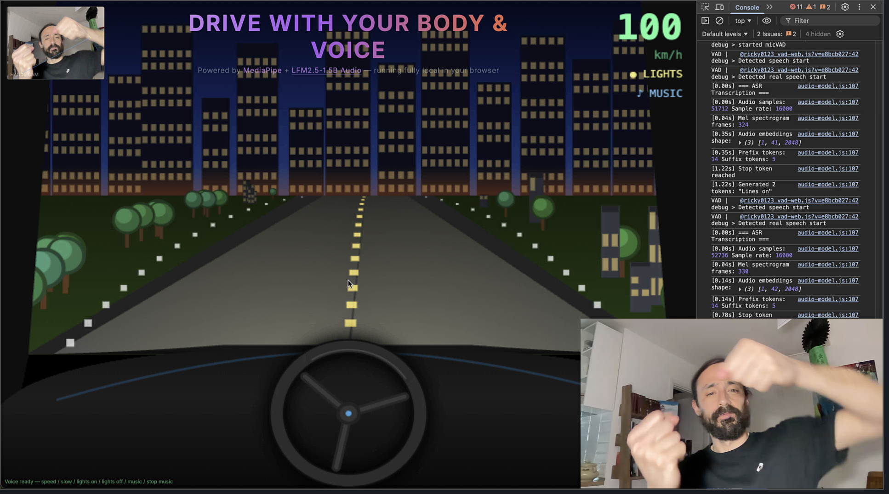

# Hand & Voice Racer

[](https://discord.com/invite/liquid-ai)



**A browser driving game you control with your hands and voice, powered by models running fully local.**

Steer by holding both hands up like a steering wheel. Speak commands to accelerate, brake, toggle headlights, and play music. No cloud calls, no server round-trips. Everything runs in your browser tab.

## How it works

Two models run in parallel, entirely client-side:

- **[MediaPipe Hand Landmarker](https://ai.google.dev/edge/mediapipe/solutions/vision/hand_landmarker)** tracks your hand positions via webcam at ~30 fps. The angle between your two wrists drives the steering.
- **[LFM2.5-Audio-1.5B](https://docs.liquid.ai/lfm/models/lfm25-audio-1.5b)** runs in a Web Worker with ONNX Runtime Web. It listens for speech via the [Silero VAD](https://github.com/snakers4/silero-vad) and transcribes each utterance on-device. Matched keywords control game state.

The audio model loads from Hugging Face and is cached in IndexedDB after the first run, so subsequent starts are instant.

## Voice commands

| Say | Effect |
|-----|--------|
| `speed` / `fast` / `go` | Accelerate to 120 km/h |
| `slow` / `stop` / `brake` | Decelerate to 0 km/h |
| `lights on` | Enable headlights |
| `lights off` | Disable headlights |
| `music` / `play` | Start the techno beat |
| `stop music` / `silence` | Stop the beat |

## Prerequisites

- Chrome 113+ or Edge 113+ (WebGPU required for fast audio inference; falls back to WASM)
- Webcam and microphone access
- Node.js 18+

## Run locally

```bash
npm install
npm run dev
```

Then open [http://localhost:3001](http://localhost:3001).

On first load the audio model (~900 MB at Q4 quantization) downloads from Hugging Face and is cached in your browser. Hand detection assets load from CDN and MediaPipe's model storage.

## Architecture

```
Browser tab
├── main thread
│   ├── MediaPipe HandLandmarker  (webcam → hand angles → steering)
│   ├── Canvas 2D renderer        (road, scenery, dashboard, HUD)
│   └── Web Audio API             (procedural techno synthesizer)
└── audio-worker.js (Web Worker)
    ├── Silero VAD                (mic → speech segments)
    └── LFM2.5-Audio-1.5B ONNX   (speech segment → transcript → keyword)
```

The game loop runs on `requestAnimationFrame`. Hand detection is throttled to ~30 fps so it does not block rendering. Voice processing happens off the main thread and delivers results via `postMessage`.

## Need help?

Join the [Liquid AI Discord Community](https://discord.com/invite/liquid-ai) and ask.

[](https://discord.com/invite/liquid-ai)
