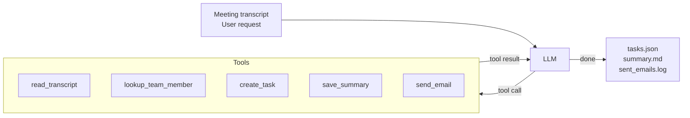

# Meeting Intelligence Agent

A local AI agent that reads meeting transcripts and turns them into structured outputs: action items, a markdown summary, and a follow-up email. Runs entirely on your hardware. Your personal or private data is not shared with any model provider.



## Table of contents

- [What it does](#what-it-does)
- [Setup](#setup)
- [Usage](#usage)
- [Benchmark](#benchmark)
- [Demo outputs](#demo-outputs)
- [Configuration](#configuration)

## What it does

Given a meeting transcript, the agent:

1. Reads the transcript
2. Identifies every action item (owner, due date, description)
3. Looks up each owner in the local team directory
4. Creates a task record for each action item (`data/tasks.json`)
5. Saves a structured markdown summary (`data/summaries/`)
6. Drafts and "sends" a follow-up email (`data/sent_emails.log`)

## Setup

**1. Install llama.cpp** (provides `llama-server`):

```bash
# macOS
brew install llama.cpp

# Linux / Windows — download a prebuilt binary from:
# https://github.com/ggml-org/llama.cpp/releases
```

**2. Clone the repository:**

```bash
git clone https://github.com/Liquid4All/cookbook.git
```

**3. Install Python dependencies:**

```bash
cd cookbook/examples/meeting-intelligence-agent
uv sync
```

## Usage

**Interactive mode:**
```bash
uv run mia --model LiquidAI/LFM2-24B-A2B-GGUF:Q4_0
> Process the meeting transcript in data/sample_transcript.txt
```

**Non-interactive mode:**
```bash
uv run mia --model LiquidAI/LFM2-24B-A2B-GGUF:Q4_0 -p "Process data/sample_transcript.txt and save the summary as sprint-42.md"
```

**With an already-running llama-server:**
```bash
# Start the server (once)
llama-server \
  --port 8080 \
  --ctx-size 32768 \
  --n-gpu-layers 99 \
  --flash-attn on \
  --jinja \
  --temp 0.1 \
  --top-k 50 \
  --repeat-penalty 1.05 \
  -hf LiquidAI/LFM2-24B-A2B-GGUF:Q4_0

# Then run the agent (server is reused across runs)
uv run mia
> Process the meeting transcript in data/sample_transcript.txt
```

## Benchmark

10-task suite covering easy → hard agentic scenarios, tested against several LFM models running locally with llama-server:

| Model | Score | Avg time | Tokens |
|---|:---:|---:|---:|
| LFM2-24B-A2B Q4_0 | 9/10 | 36.8s | 130K |
| LFM2.5-1.2B-Instruct Q4_0 | 4/10 | 24.7s | 483K |
| LFM2.5-1.2B-Thinking Q4_0 | 3/10 | 2.1s | 22K |
| LFM2-8B-A1B Q4_0 | 0/10 | 6.5s | 32K |

See [`benchmark/results/summary.md`](benchmark/results/summary.md) for per-task breakdowns.

**Run the benchmark:**
```bash
# All tasks
uv run benchmark/run.py --model LiquidAI/LFM2-24B-A2B-GGUF:Q4_0

# Subset of tasks
uv run benchmark/run.py --model LiquidAI/LFM2-24B-A2B-GGUF:Q4_0 --task 7,8,9,10
```

## Demo outputs

After running the agent on `data/sample_transcript.txt`:

```bash
cat data/tasks.json          # structured task records
cat data/summaries/*.md      # markdown meeting summary
cat data/sent_emails.log     # follow-up email log
```

## Configuration

| Environment variable    | Default                      | Description                        |
|-------------------------|------------------------------|------------------------------------|
| `MIA_LOCAL_BASE_URL`    | `http://localhost:8080/v1`   | llama.cpp server URL               |
| `MIA_LOCAL_MODEL`       | `local`                      | Model name or HuggingFace path     |
| `MIA_LOCAL_CTX_SIZE`    | `32768`                      | Context window size                |
| `MIA_LOCAL_GPU_LAYERS`  | `99`                         | GPU layers to offload (0 = CPU)    |
